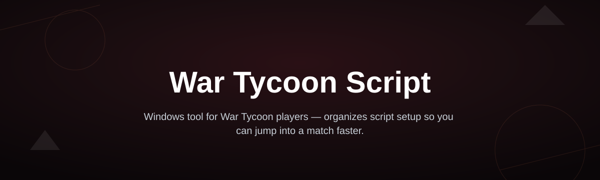
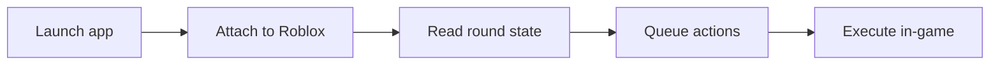

# war-tycoon-script-hub

*A calmer way for War Tycoon players to automate the grind without living inside a spreadsheet.*

## What this is

war-tycoon-script-hub started as a small notes file. A group of us kept comparing War Tycoon strategies in a Discord server, mostly around cash routes, base pathing, and which upgrades actually paid off before a wipe. Eventually someone turned the shared notes into a working script, and other players started asking for the same setup. This repo is where that script lives now: a single package built specifically for War Tycoon, focused on cutting down repetitive actions so you can spend your session deciding strategy instead of clicking the same button for twenty minutes.

The current build reads the state of your War Tycoon match and reacts to it — collecting cash drops, queueing purchases in a sensible order, and keeping your base loop running while you're focused on defense or planning the next round. It doesn't try to be a general Roblox toolkit. Everything in here is written around how War Tycoon actually plays, which is why the feature list below is short but purpose-built rather than a long list of unrelated extras.

  

The button above opens the project's landing page, where the current build is available to download.

## Who it is for

- Players who run long War Tycoon sessions and want the repetitive cash-and-buy loop handled automatically
- Base builders who care more about layout and upgrade order than manual clicking
- Server regulars who want a consistent, repeatable approach across rounds
- Newer players trying to learn efficient purchase order without memorizing it first
- Anyone contributing to the project who wants a codebase focused on one game, not a dozen

## What you can do

- **Automatic cash collection** — picks up drops around your base without manual clicking
- **Smart purchase queueing** — orders upgrades based on cost-efficiency rather than a fixed list
- **Base loop tracking** — keeps recurring actions running consistently through a round
- **Round-state awareness** — adjusts behavior between build phase and active combat
- **Lightweight overlay** — a small on-screen panel to toggle features without digging through menus
- **Session persistence** — remembers your last settings between launches
- **Safe-stop controls** — one key to pause everything instantly if the round state changes unexpectedly
- **Low resource footprint** — designed to run alongside Roblox without noticeable lag

## Getting started

1. Visit the landing page using the download button above.
2. Download the current release package for Windows.
3. Extract it to a folder of your choice.
4. Run the application and select War Tycoon from the game list.
5. Launch Roblox and join a War Tycoon server — the tool will attach automatically.

## Requirements

- Windows 10 or 11 (64-bit)
- No additional runtime, toolchain, or dependency installation
- Roblox client installed and able to run War Tycoon normally
- Standalone executable — nothing to compile or configure beforehand

## How it works

The tool sits alongside your Roblox client, reads relevant round and base data, and translates that into timed actions inside the game window.

1. Launch the app and pick War Tycoon.
2. It attaches to your running Roblox client.
3. It reads the current round and base state.
4. Actions are queued based on your settings.
5. Those actions execute in-game in real time.

## FAQ

**Is this a War Tycoon script or a general Roblox tool?**
It's built specifically for War Tycoon. It doesn't include features for other games.

**Will this work after a War Tycoon update?**
Usually within a short window after major updates. Check the landing page for the current build status before assuming it's outdated.

**Does it need admin permissions to run?**
No elevated permissions are required for normal use on Windows 10/11.

**Can I use it on Mac or a Chromebook?**
Not currently. The build is Windows-only.

**Does it affect other Roblox games I play?**
No — it only activates behavior when it detects a War Tycoon session.

## Troubleshooting

- **App won't attach to Roblox** — make sure Roblox is fully loaded into the War Tycoon server before launching the tool.
- **Overlay doesn't appear** — try running the app before starting Roblox, then relaunch Roblox.
- **Actions feel delayed** — close other background overlays or capture software that may be competing for input focus.
- **Settings reset after restart** — confirm the app folder has write permission; some antivirus tools block local config saves.

## License

Released under the [MIT License](LICENSE). This project is provided as-is, for use with War Tycoon on your own account and at your own discretion; there is no warranty of any kind.

  

